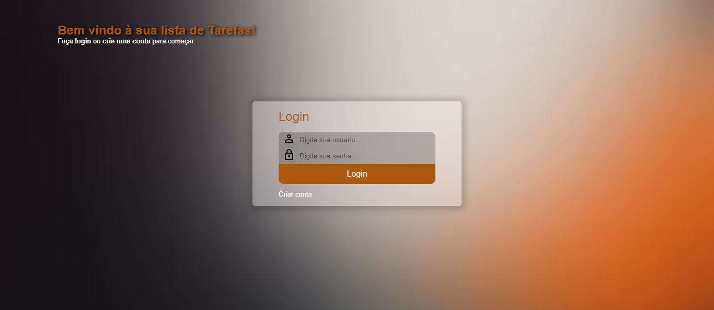
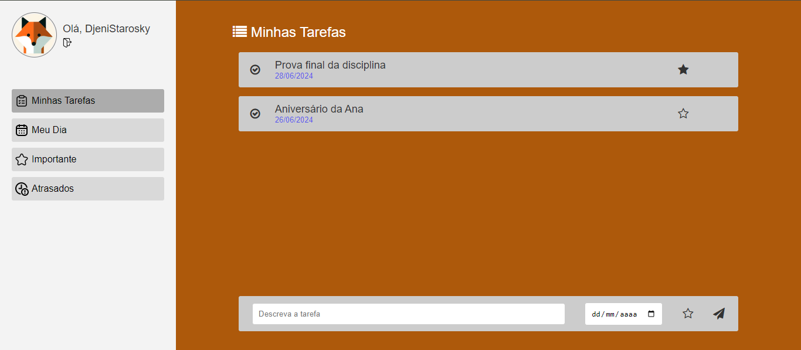

# ToDo List

Projeto desenvolvido para a disciplina **'Implementação de uma aplicação Web'** da graduação em Análise e Desenvolvimento de Sistemas - 5º semestre, UNIASSELVI.

A aplicação consiste em um sistema de gerenciamento de tarefas, onde os usuários cadastrados poderão registrar e organizar suas atividades diárias, como lembretes para consultas médicas ou provas na faculdade.

## Tecnologias Utilizadas
  - Front-end: HTML, CSS, JavaScript
  - Back-end: PHP
  - Banco de Dados: MySQL

## Funcionalidades
  - Cadastro de Usuários: Criação de usuários com login controlado por usuário e senha.
  - Cadastro de Tarefas: Inclusão de tarefas com descrição, data prevista e marcação de prioridade.
  - Alteração de Prioridade: Possibilidade de alterar a prioridade das tarefas a qualquer momento.
  - Marcação de Conclusão: Marcar tarefas como concluídas.
  - Listagem de Tarefas:
    - Minha Lista: Exibe todas as tarefas pendentes com data futura.
    - Meu Dia: Exibe todas as tarefas pendentes com a data do dia atual.
    - Importante: Exibe todas as tarefas pendentes com data futura e prioridade alta.
    - Atrasadas: Exibe todas as tarefas pendentes com data anterior ao dia atual.
    
## Melhorias Previstas
  - Utilização de Frameworks: Implementar frameworks como Bootstrap e Angular em todo o sistema para melhorar a interface e a experiência do usuário.
  - Seleção de Temas: Implementar a seleção de temas para o layout (Dark, Light e Colors).
  - Melhorias nos Controles do Sistema: Aprimorar os controles do sistema para maior eficiência e usabilidade.
  - APIs REST: Aplicação do uso de APIs REST para melhorar a comunicação entre o frontend e o backend.

Este projeto foi a minha primeira implementação criada do zero, desde a concepção do projeto até o desenvolvimento, sem a utilização de materiais de apoio de cursos.
Nas próximas semanas estarei trabalhando nele para aplicar as melhorias já previstas e quais mais eu identificar durante o processo.

## Layout final do projeto

### Tela de login

### Tela home

Desenvolvido por: Djenifer Starosky.
